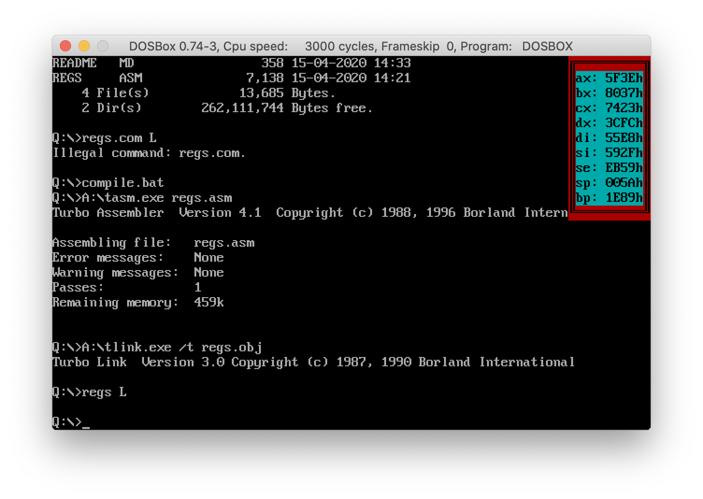

## Task: TSR window with registers values

Self painted window (based on task `task-1-border`) with registers values updated within timer interrupts.

App intercepts `09h` and `1Ch` interrupts ('key down' and 'timer'). `CapsLock` stops/resums registers updating.

### Usage

`db.com` - show 4 registers `ax`, `bx`, `cx`, `dx`

`db.com L` - show 9 registers

